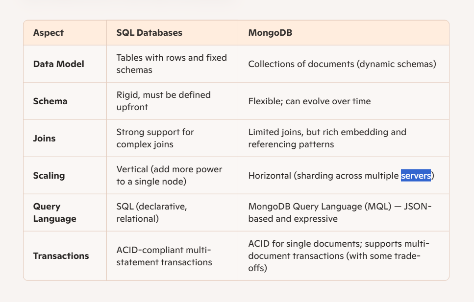

# mongodb-practices

## Intro

MongoDB is a NoSQL database that stores data in a flexible, JSON-like format (specifically BSON—Binary JSON), 
rather than the traditional rows and columns used by SQL databases. 

Here’s a breakdown to clarify why another database like MongoDB exists, 
how it differs from SQL databases, and what’s under the hood:

## Why Another Database Like MongoDB?

Relational databases (RDBMS) like MySQL or PostgreSQL have served well for decades, 
but as applications evolved—especially web, mobile, and real-time systems—the rigid 
tabular structures and normalization patterns of SQL started to show cracks in areas like:

        Handling semi-structured or dynamic data (e.g. user preferences, product attributes)

        Rapid iteration and agile development cycles

        High-volume read/write with low latency

        Horizontal scaling across distributed systems

MongoDB was born to address these gaps—especially for use cases requiring flexibility, speed, and scalability.

## Key Differences from SQL Databases

## MongoDB Internals: How It Works

Here’s a peek inside the black box:

    1. BSON Format

        Documents are stored as BSON—an efficient binary representation of JSON supporting extra types like dates and binary data. 
        This lets MongoDB support rich document structures with indexing.

    2. Storage Engine

        MongoDB uses the WiredTiger storage engine (by default), which provides:

            Document-level locking for concurrency

            Compression to save disk space

            Write-ahead journaling for durability

    3. Indexing

        Supports single field, compound, text, geospatial, hashed, and wildcard indexes. Behind the scenes, 
        it builds B-trees or variant structures for fast lookups and queries.

    4. Aggregation Pipeline

        Think of it as a data transformation and processing framework. You “pipe” documents through stages like $match, $group, 
        $project to filter, reshape, and analyze data—akin to Unix pipelines.

    5. Replication & Sharding
    
        Replication: Uses replica sets for high availability with automatic failover.

        Sharding: Distributes data across shards based on shard keys, ideal for handling 
        large-scale or geographically dispersed systems.

## WiredTiger

WiredTiger is the default storage engine used by MongoDB, 
and it's a big reason MongoDB performs so well under modern workloads.

Here’s what makes WiredTiger tick:

    1. High Concurrency with Document-Level Locking
        
        Unlike older engines that locked entire collections or databases, WiredTiger uses document-level concurrency control. 
        This means multiple clients can read and write to different documents in the 
        same collection simultaneously—great for high-throughput applications.

    2. Compression and Efficient Storage
    
        WiredTiger supports compression (like Snappy and zlib), which reduces disk I/O and storage footprint. 
        This is especially useful when you're dealing with large volumes of semi-structured data.

    3. Write-Ahead Logging (Journaling)
    
        It uses a write-ahead log to ensure durability. Changes are first written to a journal 
        before being applied to the data files, protecting against crashes or power failures.

    4. Checkpointing

        WiredTiger periodically creates checkpoints—snapshots of the data at a point in time—so MongoDB 
        can recover quickly after a restart without replaying the entire journal.

    5. Cache Management
    
        It uses an internal cache (usually about 50% of available RAM by default) to keep frequently accessed data in memory. 
        This speeds up reads and reduces disk access.

    6. ACID Transactions
    
        WiredTiger supports multi-document ACID transactions, which is a big leap for NoSQL systems. 
        It uses standard isolation levels and ensures consistency even across multiple operations.

    In short, WiredTiger is what gives MongoDB its modern edge—balancing speed, scalability, and reliability. If you're curious, you can explore more on the WiredTiger Developer Site or the MongoDB Docs.

